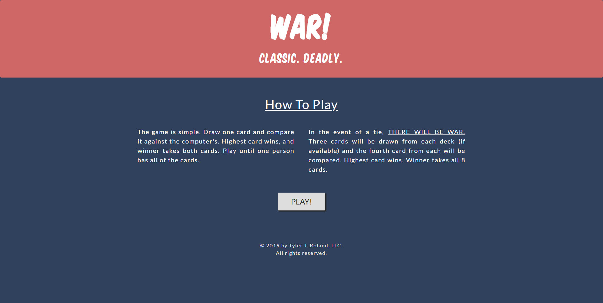
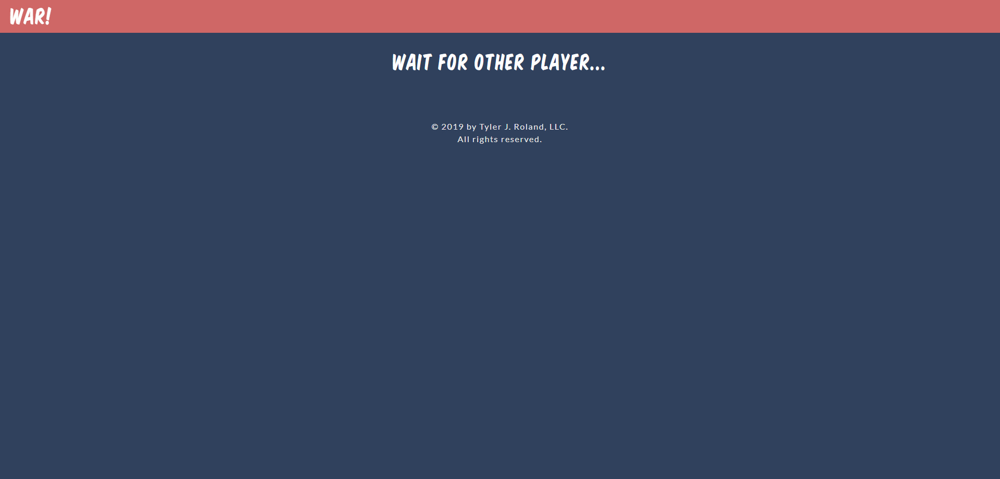
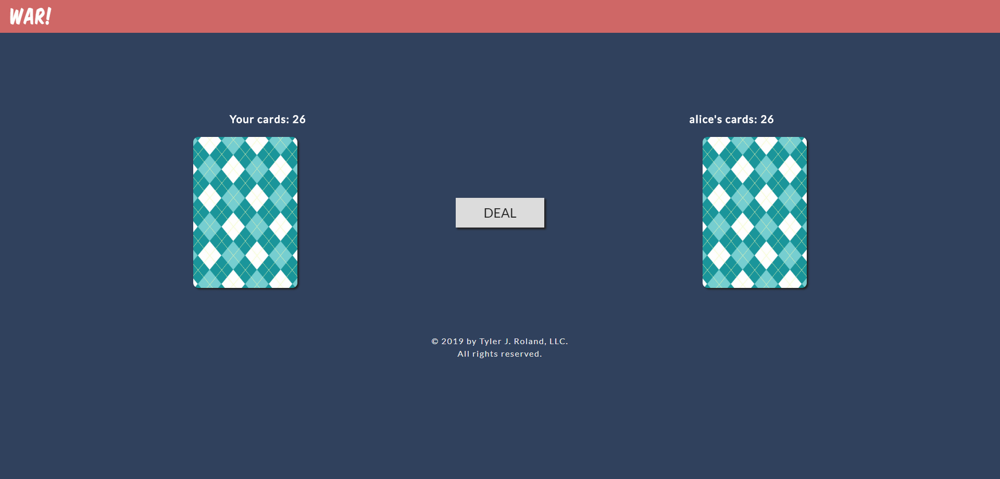
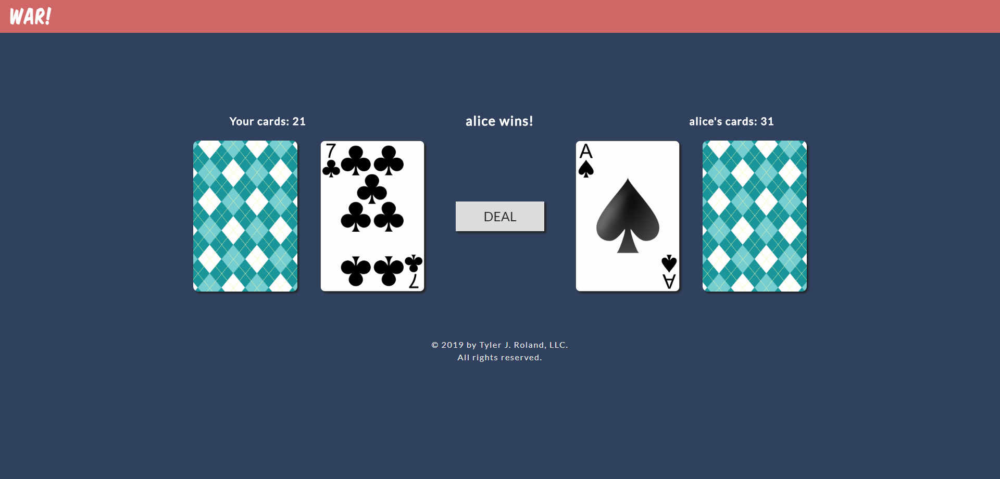

Final project of Web technologies course. Demonstrates use of different technologies for web environment.

# WAR Cards Game
Was taken from MisterTeeRoland's git [repository](https://github.com/MisterTeeRoland/war) and added a layer of player vs player using [socket.io](https://socket.io/) library and nodejs.

## Installation
In order to run the project, please follow these steps:

1. Install [node with npm](https://nodejs.org/en/download/) (if haven't already).
Make sure that node and npm added to [environment PATH](https://www.java.com/en/download/help/path.xml).
2. Download or clone our [game](War/) code.
You will find our server running at PORT 80 with base url of /newFacebook.
3. Open cmd and change directory to the local root directory.
4. Type 'npm install' and wait for the required packages to be installed.
5. When installation finished, type 'npm start'.

The client will be available at your localhost, port 5000 with url localhost:5000/{:name} (name is a path paramter representing the player's name).
You can type it manually or reach it with our (new) facebook platform.

### Screenshots

